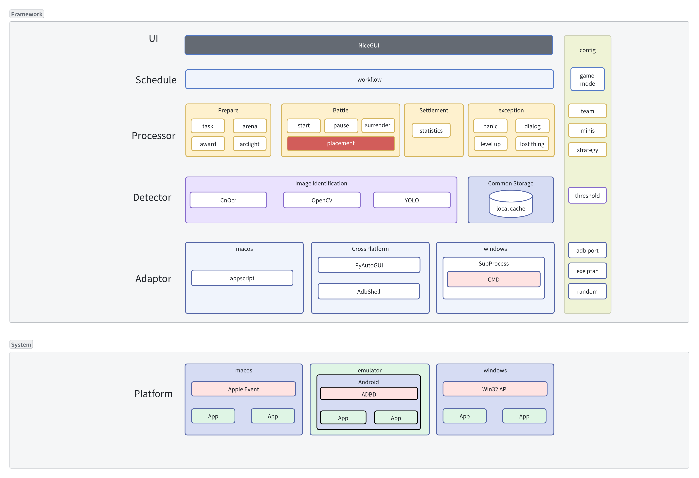
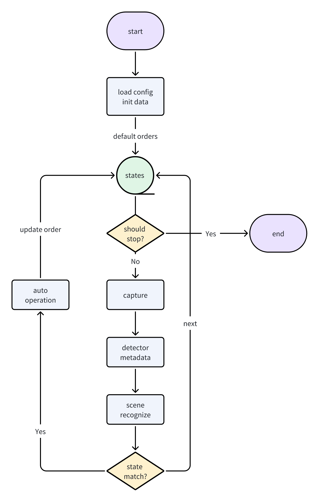

# Python学习实践-简单游戏自动化脚本的实现

## 基本框架



### Adaptor

适配层主要与系统App通信及自动化操控。

* 模拟器上的Android App: 使用ADB进行交互，推荐第三方客户端AdbShell，接口封装度高。如果用官方下载的adb工具，Python中需要通过子进程调用，比较麻烦。ADB协议本身就是跨平台的。
* windows App: 比如想要打开或者关闭模拟器，使用Python子进程运行windows cmd来实现。
* mac app: mac m芯片可原生运行大部分ios app，使用appscript来开启、全屏化及关闭App，使用pyautogui模拟鼠标和键盘自动化控制App。

### Detector

识别层主要检测App当前的状态信息，供上层使用。

* cnocr: 检测画面中的文本信息。
* opencv: 提供图像匹配、图像比较等能力，检测画面是否存在目标图像。
* yolo模型: 目标检测模型，通过数据集进行训练，可提供更精确的目标识别能力。
* 其他诸如APP是否在运行等基础信息。

### Processor

处理层主要根据识别层提供的数据，判断游戏当前的场景(或状态,下文场景状态混用，意思一样)并进行决策执行。

* 游戏中的每个场景(状态)都有一个对应的processor。
* processor会检测当前App是否处于其负责的场景。
* processor运行自己的决策逻辑，最终输出操作指令给适配层执行。

### Schedule

调度层根据游戏流程来编排Processor执行顺序，并处理各种意外情况，保证程序稳定正确运行。

### UI

ui提供图形化的用户操作界面，可以修改配置并启动或关闭程序。

### Config

程序运行时依赖的配置项，可通过UI让用户修改。

## 调度过程

如果游戏流程比较复杂且不稳定，线性调度编程会复杂并难以维护。采用类似状态机的状态流转实现调度过程，逻辑会更加清晰，并具有较高的稳定性保证。
以简单的贪吃蛇游戏举例来说，打开游戏后的主界面有个开始按钮，点击开始后就进入游戏画面，玩家上下左右控制方向，失败后会弹出一个游戏结束确认按钮，点击后会回到主界面。

线性实现流程代码可能是这样:

```python
while True:
    if is_waiting_start():
        click_start()
        if is_gaming(context):
            game_process()
            if end_confirm(context):
                click_end()
```

可以定义三种状态：等待开始，游戏中，结束确认。
用状态流转实现可以简化成下面这样:

```python
states = ["waiting_start","gaming","waiting_end"]
while True:
    for state in states:
        processor = Processor.get(state)
        if processor.run(): # state匹配成功并执行完成
            update_states(processor.next_states()) # 将当前state结束后可能出现的state更新到最前
            break
```




## 主要使用的仓库

* [adb-shell](https://github.com/JeffLIrion/adb_shell) ADB的Python实现，和Android模拟器进行交互。
* [PyAutoGUI](https://github.com/asweigart/pyautogui) 纯Python跨平台的GUI自动化工具，可用程序自动控制鼠标和键盘操作。
* [appscript](https://github.com/hhas/appscript/blob/master/py-appscript/README.rst)  高层级用户友好的AppleEvent桥接器，使用Python控制 [AppleScriptable](https://developer.apple.com/documentation/scriptingbridge) Mac应用程序。
* [cnocr](https://github.com/breezedeus/CnOCR) 使用非常便捷的开源ocr框架。
* [opencv-python](https://github.com/opencv/opencv-python) 强大的计算机图像处理引擎的Python SDK。
* [YOLOv8](https://github.com/ultralytics/ultralytics) 上手比较容易地识别模型训练引擎，速度和准确性都非常好。
* [nicegui](https://github.com/zauberzeug/nicegui/) Python的GUI框架，没发现比这个使用更简单的了，基于web技术。
* [pyinstaller](https://github.com/pyinstaller/pyinstaller) 将Python脚本构建成应用程序，支持多平台。
* [pyyaml](https://github.com/yaml/pyyaml) Python读写yaml配置文件。

